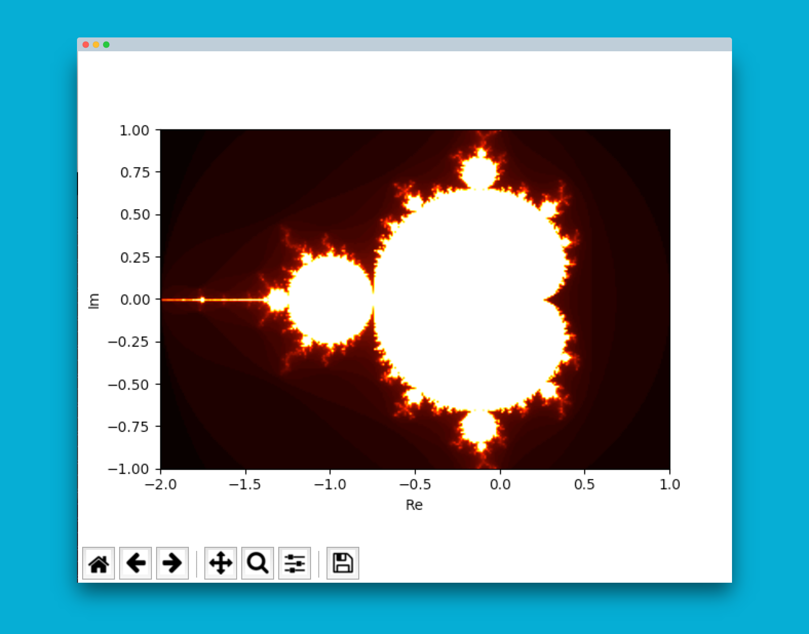

## Mandelbrot Set



---

This is a simple Mandelbrot Python backend. It can calculate any given area and returns its values
in an array.

### How to run the development server on your system: 

1. `$ pip install -r requirements.txt`
2. `$ export FLASK_APP=src/server.py`
3. `$ flask run --host=0.0.0.0 --port=8080`

You may need to do some extra steps to install matplotlib, depending on your os.
To make the dev server visible in your network use `$ flask run --host=0.0.0.0`

### How to test the server:

```
$ curl --header "Content-Type: application/json" \
       --request POST \
       --data '{"RealFrom":-2, "RealTo":1, "ImaginaryFrom": -1, "ImaginaryTo":1, "Intervall": 0.01, "MaxIteration": 100}' \
       http://localhost:8080
```

### How to test the Mandelbrot Class:

Either:

1. go to http://localhost:8080/client
2. watch the mandelbrot
3. change variables in `src/templates/client.html`
4. repeat steps 1+2

Or:

1. `$ python src/test_plot.py`
2. watch the plot
3. change constructor params in `src/test_plot.py`
4. repeat steps 1+2